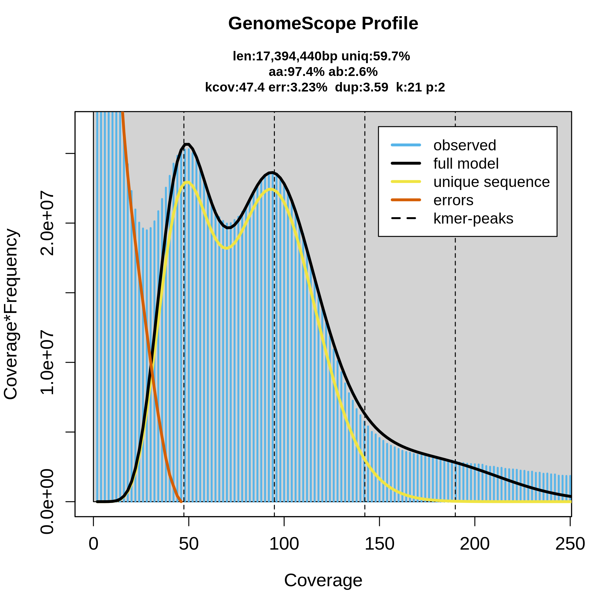
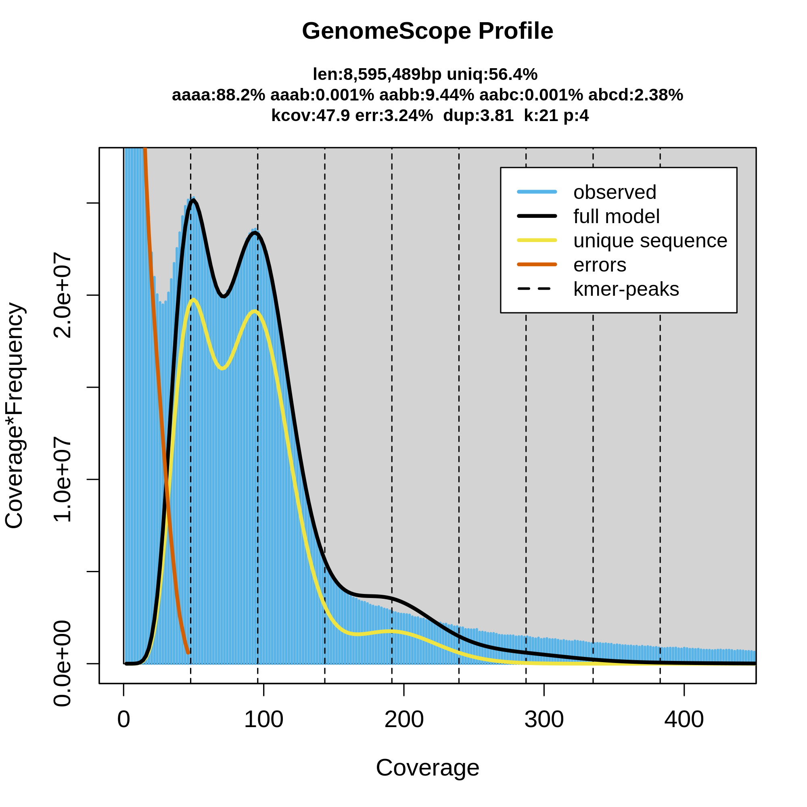
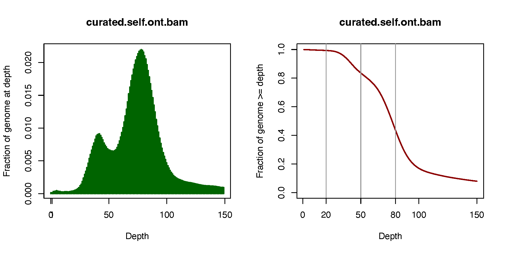

## assembly

### name

    ***** Results: *****

    C:90.3%[S:76.3%,D:14.0%],F:2.3%,M:7.4%,n:600       
    542    Complete BUSCOs (C)               
    458    Complete and single-copy BUSCOs (S)       
    84    Complete and duplicated BUSCOs (D)       
    14    Fragmented BUSCOs (F)               
    44    Missing BUSCOs (M)               
    600    Total BUSCO groups searched     

	Assembly                    curated_without_ctg000290_np1212_pilon
	# contigs (>= 0 bp)         20                                    
	# contigs (>= 1000 bp)      20                                    
	# contigs (>= 5000 bp)      20                                    
	# contigs (>= 10000 bp)     20                                    
	# contigs (>= 25000 bp)     20                                    
	# contigs (>= 50000 bp)     20                                    
	Total length (>= 0 bp)      16375077                              
	Total length (>= 1000 bp)   16375077                              
	Total length (>= 5000 bp)   16375077                              
	Total length (>= 10000 bp)  16375077                              
	Total length (>= 25000 bp)  16375077                              
	Total length (>= 50000 bp)  16375077                              
	# contigs                   20                                    
	Largest contig              1930326                               
	Total length                16375077                              
	GC (%)                      21.98                                 
	N50                         989478                                
	N75                         772343                                
	L50                         7                                     
	L75                         11                                    
 
  

### mapping stats for new reference

  
diploid model | tetraploid model
:-------------------------:|:-------------------------:
 |   
  
  
