## assembly

### Ordospora colligata

    ***** Results: *****

    C:99.0%[S:98.0%,D:1.0%],F:0.0%,M:1.0%,n:600       
    594    Complete BUSCOs (C)               
    588    Complete and single-copy BUSCOs (S)       
    6    Complete and duplicated BUSCOs (D)       
    0    Fragmented BUSCOs (F)               
    6    Missing BUSCOs (M)               
    600    Total BUSCO groups searched

    Assembly                    GB_ELK1_1.busco.blast.self
    # contigs (>= 0 bp)         9                         
    # contigs (>= 50000 bp)     9                         
    Total length (>= 0 bp)      3229452                   
    Total length (>= 1000 bp)   3229452                   
    Total length (>= 5000 bp)   3229452                   
    Total length (>= 10000 bp)  3229452                   
    Total length (>= 25000 bp)  3229452                   
    Total length (>= 50000 bp)  3229452                   
    # contigs                   9                         
    Largest contig              404995                    
    Total length                3229452                   
    GC (%)                      37.49                     
    N50                         375813                    
    N75                         322839                    
    L50                         5                         
    L75                         7                         
    # N's per 100 kbp           0.00     

## alignement to short read assembly (d-genies)

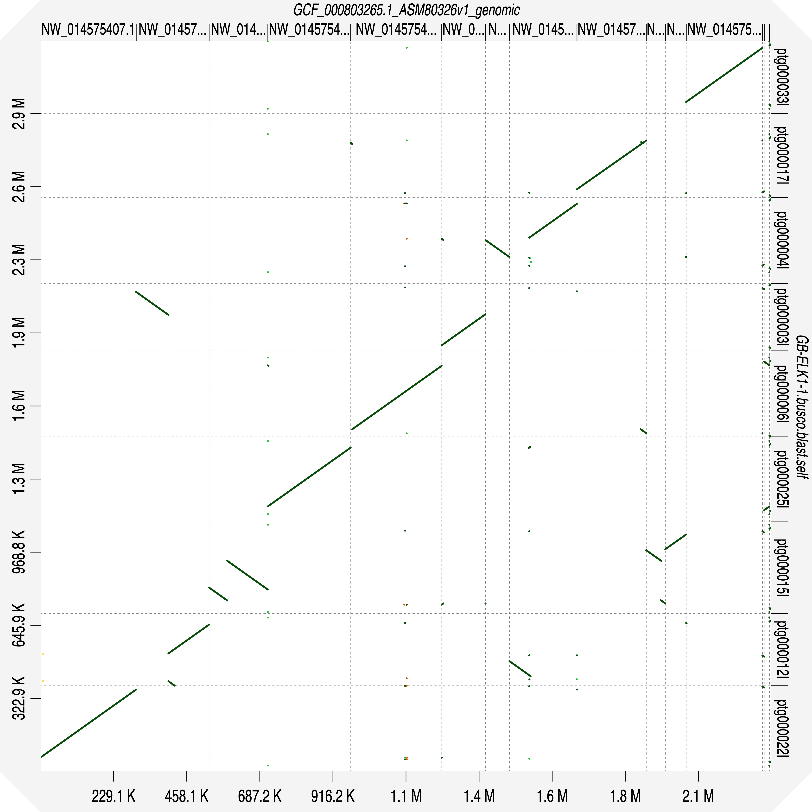

## alignement to E. cuniculi (d-genies)

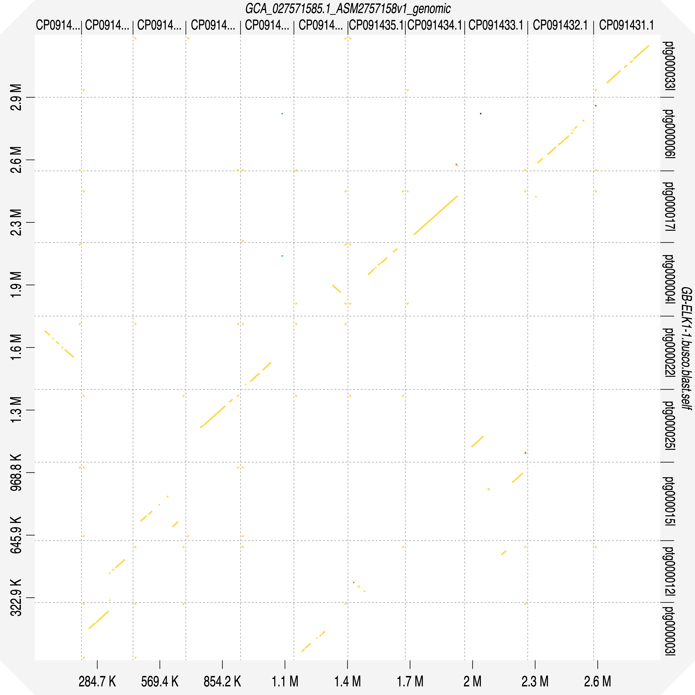

## methylation pattern (pb-CpG-tools)

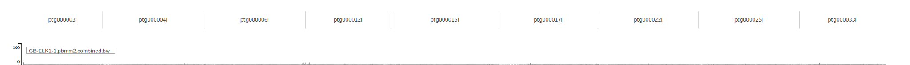

## methylation pattern (ccsmeth)

-> drop in AT and increased methylation where ribosomal subunit genes

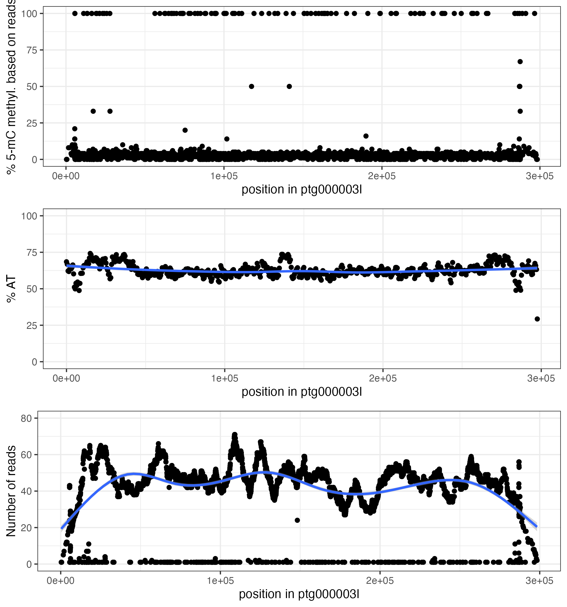  
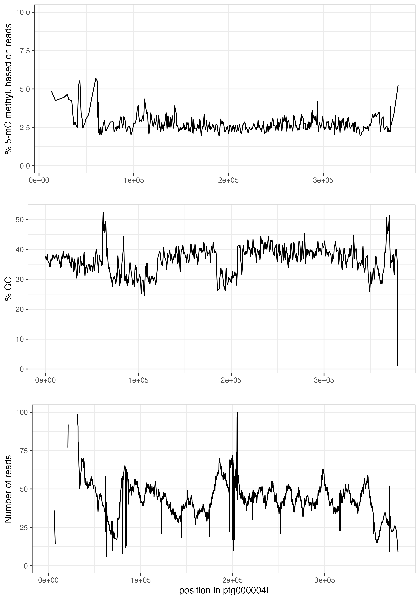  
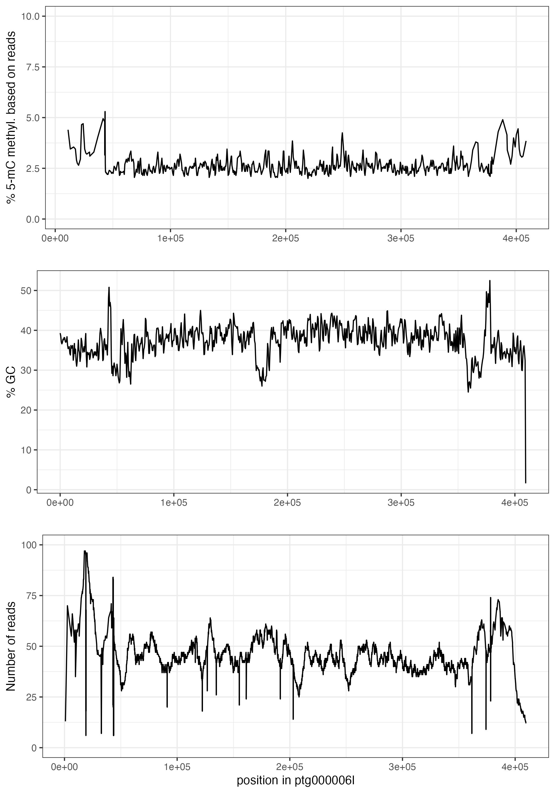  
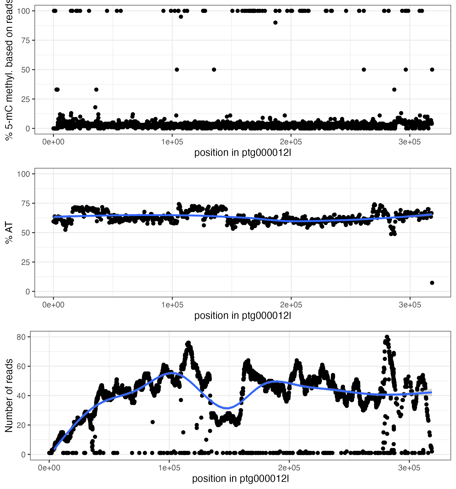  
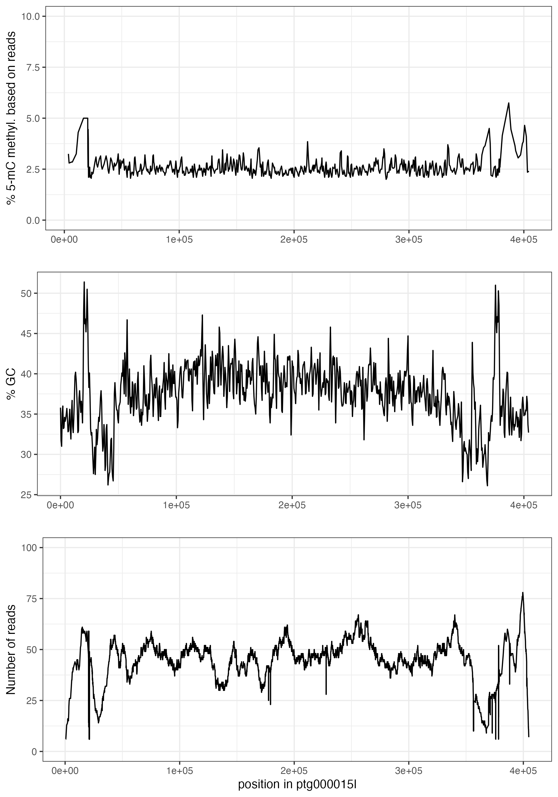  
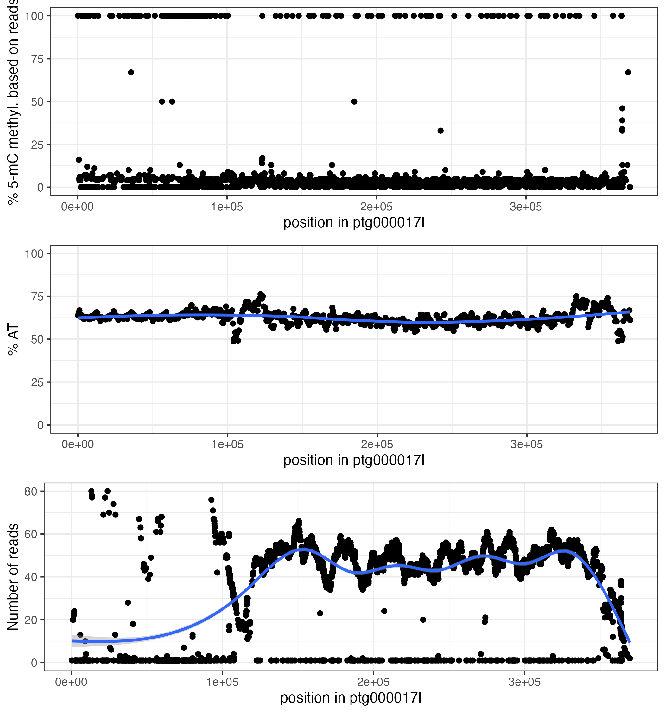  
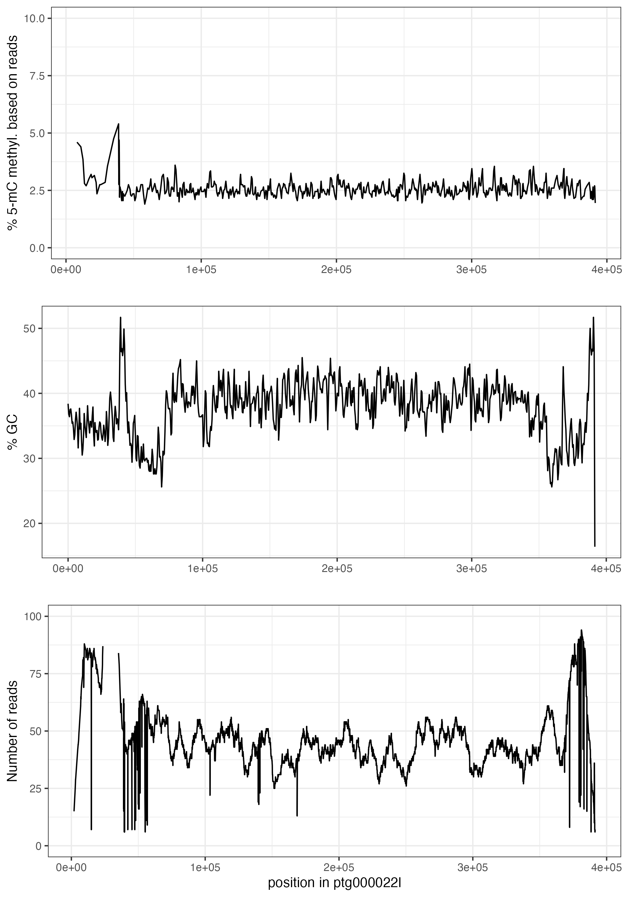  
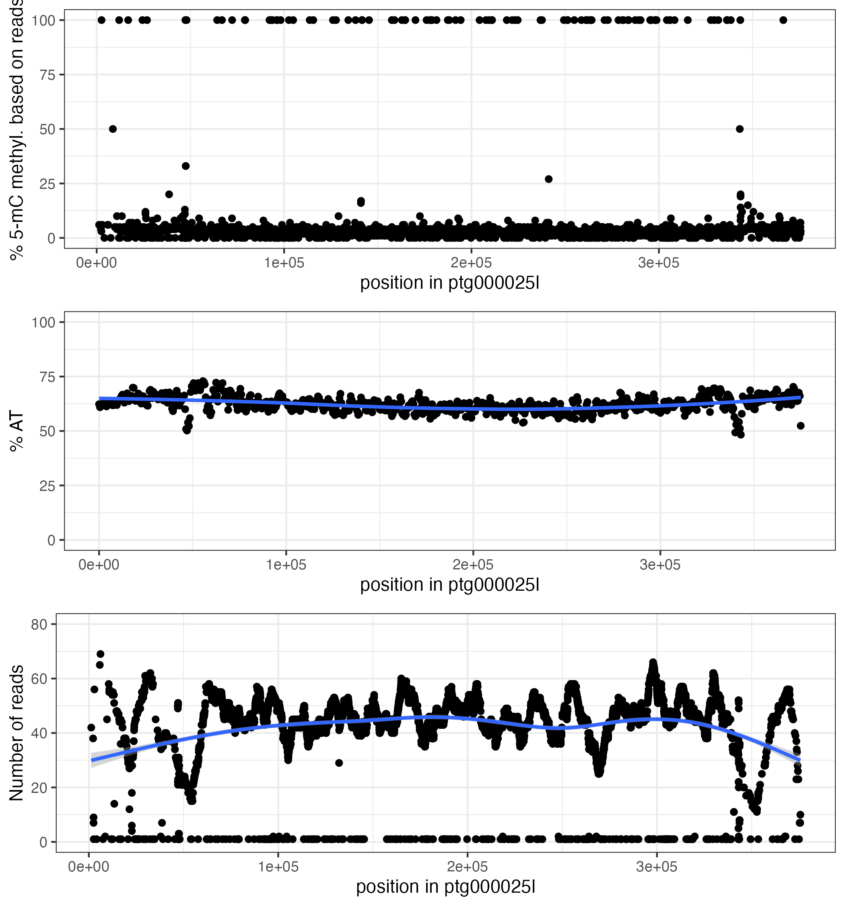  
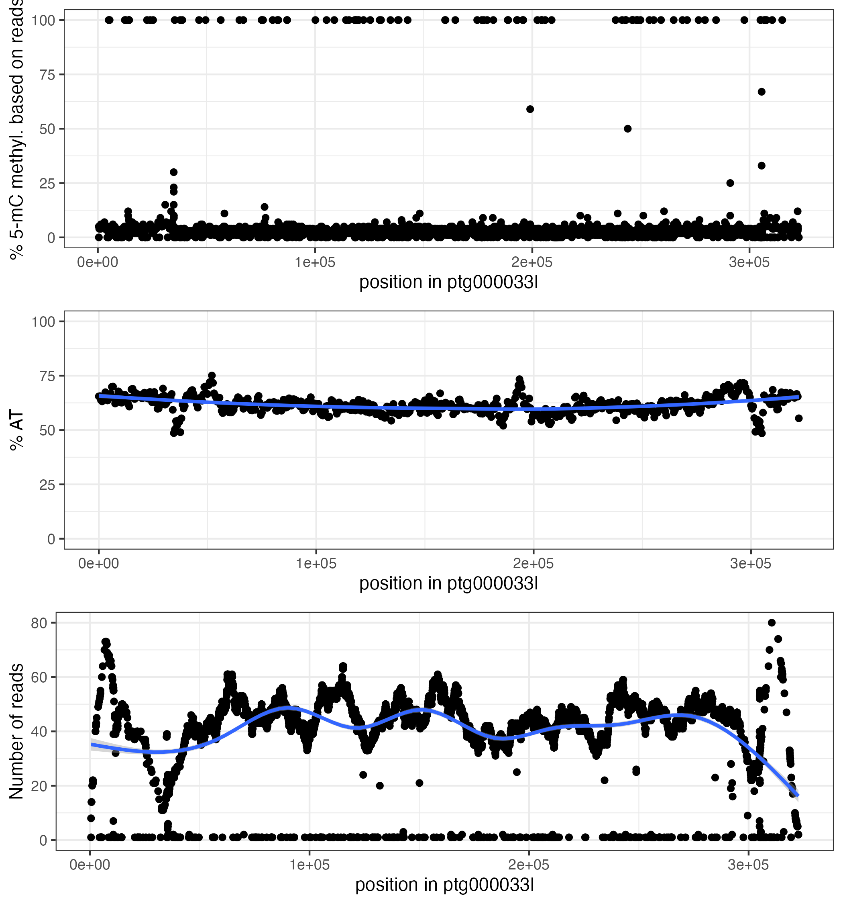  

