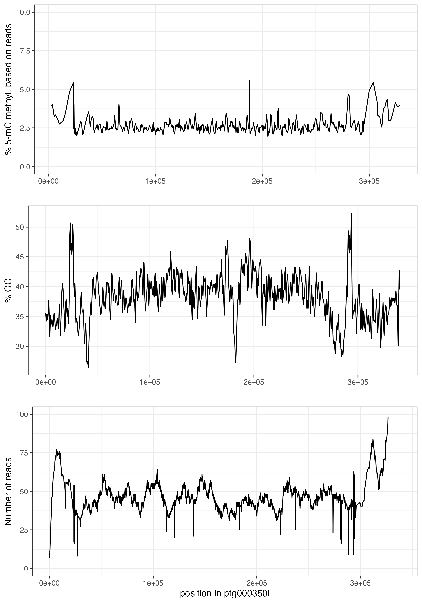

## assembly

### Ordospora colligata

    ***** Results: *****

    C:99.0%[S:98.7%,D:0.3%],F:0.0%,M:1.0%,n:600       
    594    Complete BUSCOs (C)               
    592    Complete and single-copy BUSCOs (S)       
    2    Complete and duplicated BUSCOs (D)       
    0    Fragmented BUSCOs (F)               
    6    Missing BUSCOs (M)               
    600    Total BUSCO groups searched

    Assembly                    GB_LK1_1.manual.merge
    # contigs (>= 0 bp)         9                    
    # contigs (>= 1000 bp)      9                    
    # contigs (>= 5000 bp)      9                    
    # contigs (>= 10000 bp)     9                    
    # contigs (>= 25000 bp)     9                    
    # contigs (>= 50000 bp)     9                    
    Total length (>= 0 bp)      3181619              
    Total length (>= 1000 bp)   3181619              
    Total length (>= 5000 bp)   3181619              
    Total length (>= 10000 bp)  3181619              
    Total length (>= 25000 bp)  3181619              
    Total length (>= 50000 bp)  3181619              
    # contigs                   9                    
    Largest contig              410041               
    Total length                3181619              
    GC (%)                      37.53                
    N50                         374328               
    N75                         332792               
    L50                         5                    
    L75                         7                    
    # N's per 100 kbp           0.00     
    
    # telomeric repeats:
    ### Contig    Length    # of pattern (start)    # of rev pattern (start)    # of pattern (end)    # of rev pattern (end)    Status
    ptg000004l    380,045    0    0    1    0    contig with no chromosome end attached
    ptg000006l    410,041    0    1    0    0    contig with no chromosome end attached
    ptg000015l    404,995    0    1    2    0    contig with no chromosome end attached
    ptg000022l    392,470    0    0    1    0    contig with no chromosome end attached
    ptg000077l    332,792    1    0    1    0    contig with no chromosome end attached
    ptg000237l    270,892    1    0    2    0    contig with no chromosome end attached
    ptg000263l    374,328    0    1    177    0    partial chromosome with 1 telomere end
    ptg000349l    275,127    0    1    0    1    contig with no chromosome end attached
    ptg000350l    340,929    0    0    176    0    partial chromosome with 1 telomere end
    
    # 16S rRNA gene:
    XR_001377306.1    ptg000237l    100.000    1383    0    0    1    1383    9210    7828    0.0    2555
    XR_001377306.1    ptg000237l    100.000    1383    0    0    1    1383    257961    259343    0.0    2555
    XR_001377306.1    ptg000349l    100.000    1383    0    0    1    1383    38119    36737    0.0    2555
    XR_001377306.1    ptg000077l    100.000    1383    0    0    1    1383    9299    7917    0.0    2555
    XR_001377306.1    ptg000077l    99.639    1385    3    2    1    1383    283776    285160    0.0    2529
    XR_001377306.1    ptg000350l    100.000    1383    0    0    1    1383    290503    291885    0.0    2555
    XR_001377306.1    ptg000350l    99.639    1385    3    2    1    1383    27356    25972    0.0    2529
    XR_001377306.1    ptg000263l    100.000    1383    0    0    1    1383    324221    325603    0.0    2555
    XR_001377306.1    ptg000015l    100.000    1383    0    0    1    1383    24377    22995    0.0    2555
    XR_001377306.1    ptg000015l    99.639    1385    3    2    1    1383    375184    376568    0.0    2529
    XR_001377306.1    ptg000004l    100.000    696    0    0    1    696    65960    65265    0.0    1286
    XR_001377306.1    ptg000004l    100.000    696    0    0    1    696    367356    368051    0.0    1286
    XR_001377306.1    ptg000004l    100.000    640    0    0    744    1383    65250    64611    0.0    1182
    XR_001377306.1    ptg000004l    100.000    640    0    0    744    1383    368066    368705    0.0    1182
    XR_001377306.1    ptg000022l    100.000    696    0    0    1    696    42874    42179    0.0    1286
    XR_001377306.1    ptg000022l    100.000    696    0    0    1    696    387629    388324    0.0    1286
    XR_001377306.1    ptg000022l    100.000    640    0    0    744    1383    42164    41525    0.0    1182
    XR_001377306.1    ptg000022l    100.000    640    0    0    744    1383    388339    388978    0.0    1182
    XR_001377306.1    ptg000006l    100.000    696    0    0    1    696    374998    375693    0.0    1286
    XR_001377306.1    ptg000006l    100.000    640    0    0    744    1383    375708    376347    0.0    1182

## alignment to short read assembly (d-genies)

## alignment to O. pajunii (d-genies)

## alignment to E. cuniculi (d-genies)

## methylation pattern (ccsmeth)

-> drop in AT and increased methylation where ribosomal subunit genes

  
  
  
  
  
  
  
  
 
