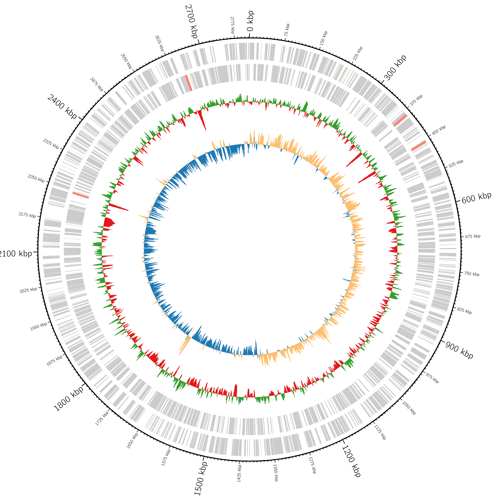

## assembly

potential outgroup with good genome: Silvanigrella aquatica

    # BUSCO version is: 5.4.5 
    # The lineage dataset is: proteobacteria_odb10 (Creation date: 2021-02-23, number of genomes: 2337, number of BUSCOs: 219)
    # Summarized benchmarking in BUSCO notation for file /home/pascal/assemblies/Spiro/ont/assembly_meta_ont.Spiro.fasta
    # BUSCO was run in mode: prok_genome
    # Gene predictor used: prodigal

    ***** Results: ***** (proteobacteria_odb10)

    C:74.0%[S:73.5%,D:0.5%],F:6.8%,M:19.2%,n:219       
    162    Complete BUSCOs (C)               
    161    Complete and single-copy BUSCOs (S)       
    1    Complete and duplicated BUSCOs (D)       
    15    Fragmented BUSCOs (F)               
    42    Missing BUSCOs (M)               
    219    Total BUSCO groups searched           

    Assembly Statistics:
    1    Number of scaffolds
    1    Number of contigs
    2806830    Total length
    0.000%    Percent gaps

